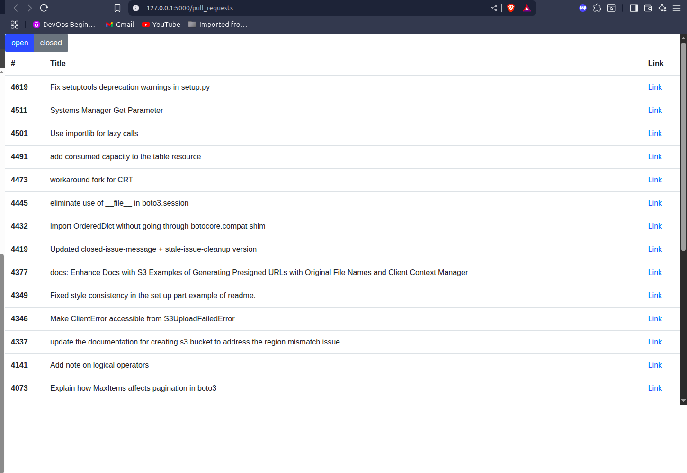

# 🚀 Flask GitHub Pull Request Viewer

This is a Flask web application that retrieves pull requests from the [boto3](https://github.com/boto/boto3) repository using the **GitHub REST API**.

---

## ✨ Features
- Lists pull requests with:
  - PR number
  - PR title
  - Direct link to GitHub
- Filter PRs by state:
  - `open`
  - `closed`

---

## 📦 Requirements
- Python 3.8+
- A GitHub **Personal Access Token**

---

## ⚙️ Installation

1. Clone this repository:
   ```
   bash
   git clone https://github.com/99Diego/flask-github-prs.git
   cd flask-github-prs
```
2. Create a virtual environment
```bash
python3 -m venv venv
```
3. Install dependecies
```
bash
pip install -r requeriments.txt
```

---

# 🔑 Setup
Export your Github Personal Access Token
```
bash
export TOKEN=your_token_here
```

---


# ▶️ Run the app
```
bash
python start.py
```
then open in your browser
👉 http://127.0.0.1:5000/pull_requests

---

# 📸 Screenshot


# 📚 References

- GitHub REST API - Pull Requests

- Flask Documentation
